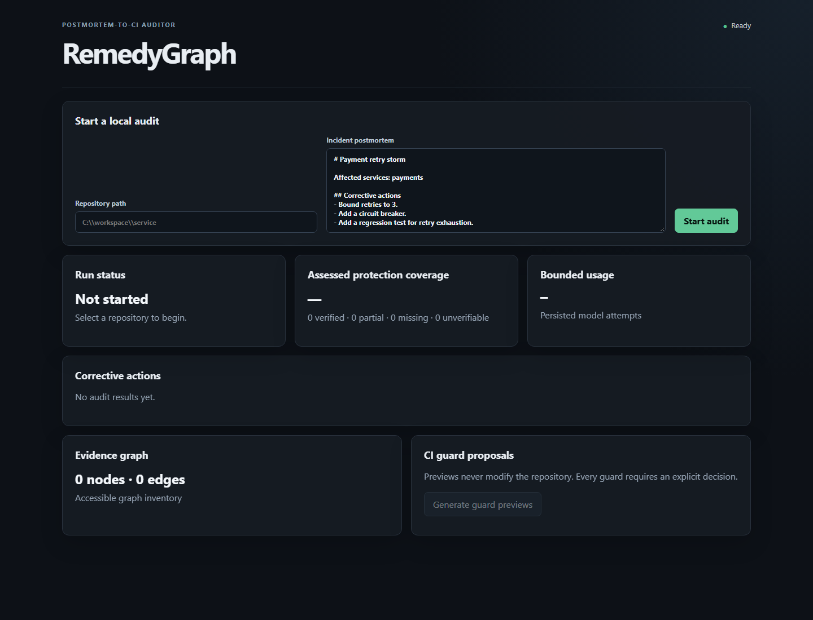

# RemedyGraph

RemedyGraph is an evidence-backed reliability auditor. It turns corrective actions from incident
postmortems into measurable invariants, investigates the associated repository, applies
deterministic checks, and reports `VERIFIED`, `PARTIAL`, `MISSING`, or `UNVERIFIABLE` with citations
and missing-proof explanations.

Unlike a document chatbot, RemedyGraph closes the postmortem-to-CI loop:

```text
postmortem -> atomic action -> invariant -> repository evidence -> verdict -> approved CI guard
```



## What the MVP demonstrates

- Safe, bounded local repository ingestion with path, secret, binary, size, and symlink controls.
- Markdown/text ingestion plus optional local PDF, DOCX, and PPTX conversion through MarkItDown.
- Python-aware chunking, SQLite FTS5/BM25, optional local embeddings, and hybrid retrieval.
- A seven-stage LangGraph audit with persisted budgets and conservative deterministic verdicts.
- Evidence graphs and source-located citations that do not treat documentation or Git claims as
  implementation proof.
- Application-owned guard previews with SHA-256-bound human approval and isolated execution.
- A live React dashboard and a reproducible, synthetic RemedyBench smoke evaluation.

## Quickstart

Requirements: Python 3.11+, Node.js 22+, and Git.

```powershell
git clone https://github.com/Naveenbtnk/RemedyGraph.git
cd RemedyGraph
python -m venv .venv
.\.venv\Scripts\Activate.ps1
python -m pip install -e ".[dev]"
npm ci --prefix frontend
```

Terminal 1:

```powershell
$env:REMEDYGRAPH_WORKSPACE_ROOT = (Get-Location).Path
uvicorn backend.app.main:app --reload
```

Terminal 2:

```powershell
npm run dev --prefix frontend
```

Open `http://localhost:5173`. Use `remedybench/repositories/I04` as the repository and paste the
contents of `remedybench/incidents/I04.md` to see all three assessable verdicts in one audit.

No API key is needed: the default provider, embeddings, tests, and benchmark are deterministic and
network-free.

## Reproduce the benchmark

```powershell
python -m backend.app.evaluation.cli --benchmark remedybench --check
```

The smoke set contains five synthetic incidents and 15 atomic actions spanning timeout, retry
jitter, circuit breaker/fallback, queue bounds, feature flags, hard-negative documentation, and all
four verdict classes. Published numbers in this README come only from
[`evals/results/remedybench-smoke.json`](evals/results/remedybench-smoke.json).

### Measured smoke results

| Metric | Measured result |
|---|---:|
| Action extraction F1 | 1.000 |
| Evidence Recall@5 | 1.000 |
| Citation accuracy | 1.000 |
| Verification macro-F1 | 1.000 |
| Guard runnable rate | 1.000 |
| Guard seeded-bad-state detection | 1.000 |
| Average model calls per incident | 1.000 |
| P50 / P95 duration | 301.418 ms / 346.385 ms |

These are measured results for the bundled five-case deterministic smoke set, not evidence of
generalization to arbitrary production repositories. The JSON artifact records every prediction,
the implementation commit, benchmark hash, provider, prompt version, configuration, timestamps,
and per-case durations.

## Verify the project

```powershell
ruff check .
ruff format --check .
mypy backend
python -m pytest -q
npm run lint --prefix frontend
npm test --prefix frontend -- --run
npm run build --prefix frontend
```

The same network-free checks run in GitHub Actions.

## Safety model

Repository content is untrusted. Paths must stay inside `REMEDYGRAPH_WORKSPACE_ROOT`; likely secrets
are redacted before display or storage. An audit never writes to the repository. Guard previews are
generated only from exact application-owned templates, and writing/execution requires an explicit
approval tied to the preview hash. The runner uses a fixed no-shell Python command, closed stdin, a
scrubbed environment, timeout, and output caps.

RemedyGraph provides evidence for engineering review; it does not prove that a system is incident-
free or replace operational validation.

## Documentation

- [Product requirements](docs/PRD.md)
- [Architecture](docs/ARCHITECTURE.md)
- [Design](docs/DESIGN.md)
- [Decisions](docs/DECISIONS.md)
- [Testing and evaluation](docs/TESTING.md)
- [Deployment and demo strategy](docs/DEPLOYMENT.md)
- [Current implementation status](docs/STATUS.md)
- [RemedyBench provenance and contract](remedybench/README.md)
